# 听声无恙 - 伪装语音检测与声纹识别系统

本项目是一款基于 **Android 平台** 的手机 APP，核心功能是实现一个基于 **自监督学习** 的伪装语音检测系统。该系统旨在有效、鲁棒地抵抗包括**重放攻击、拼接攻击、语音转换 (Voice Conversion, VC) 攻击**在内的多种常见伪装语音攻击手段，从而保障语音交互场景下，特别是声纹识别系统的安全性。

在 Android 系统中，此伪装语音检测模块已成功嵌入基于 **科大讯飞语音识别 API 平台** 构建的说话人识别（声纹识别）流程中，形成了一套能够抵御多种伪装语音攻击的安全声纹识别解决方案。

**项目主页 (GitHub Pages):** [点击访问 听声无恙 项目主页](https://setsu1na.github.io/Speech-Detection/) 
**GitHub 仓库:** [https://github.com/Setsu1na/Speech-Detection](https://github.com/Setsu1na/Speech-Detection)

## 核心功能与技术特性

*   🛡️ **先进检测算法：** 采用基于自监督学习的模型，无需大量攻击样本即可有效识别伪造语音。
*   🚫 **多攻击防御：** 可靠抵御包括重放、拼接、语音转换 (VC) 在内的多种主流伪装语音攻击。
*   🤖 **Android 平台集成：** 以 APP 形式运行于 Android 设备，提供移动端安全解决方案。
*   🔊 **讯飞 API 融合：** 无缝嵌入科大讯飞语音识别流程，增强现有声纹识别系统的安全性。
*   📈 **高鲁棒性与效率：** 系统在保证检测准确率的同时，兼顾了运行效率和对环境变化的鲁棒性。
*   🔒 **保障识别安全：** 为声纹注册、登录等身份验证环节提供关键的安全防护层。

## 系统架构

本 Android APP 系统采用分层设计，主要包含以下三个层次：

1.  **用户界面层 (UI Layer):**
    *   负责用户交互，提供注册和登录功能。
    *   界面设计注重用户习惯和审美，引导用户通过麦克风输入语音。
    *   接收来自检测层的反馈，决定用户流程。

2.  **伪装语音检测层 (Detection Layer):**
    *   **系统核心**，判断输入语音的真伪。
    *   内部包含：
        *   **编码模块:** 以自监督编码器为核心，提取鲁棒且高区分度的语音特征。
        *   **判别模块:** 结合编码器训练的伪装语音判别器，快速准确识别伪造语音。

3.  **说话人识别层 (Recognition Layer):**
    *   调用 **科大讯飞说话人识别 SDK** 实现。
    *   负责声纹模型的建立（注册）和比对（登录）。

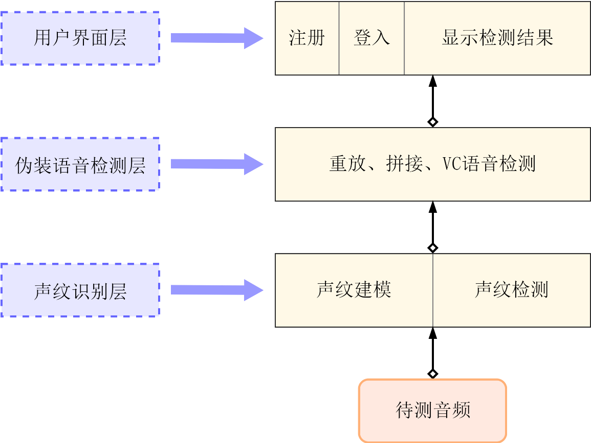 

### 关键技术概览

*   **伪装语音特性分析：** 深入分析多种攻击方式产生的信号失真特性。
    *   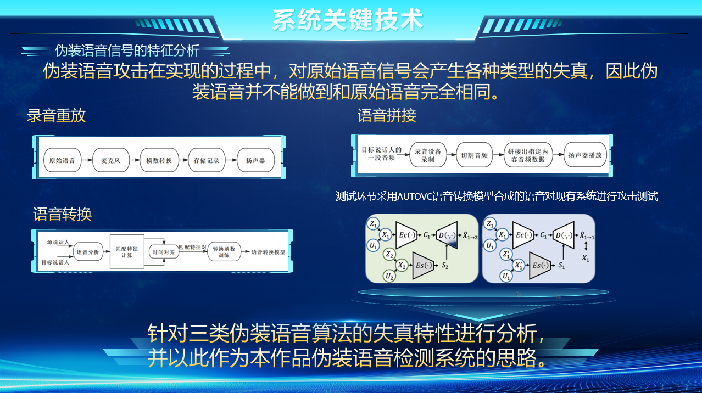
*   **自监督检测系统：** 构建基于自监督学习的伪装语音检测系统（编码模块+判别模块）。
    *   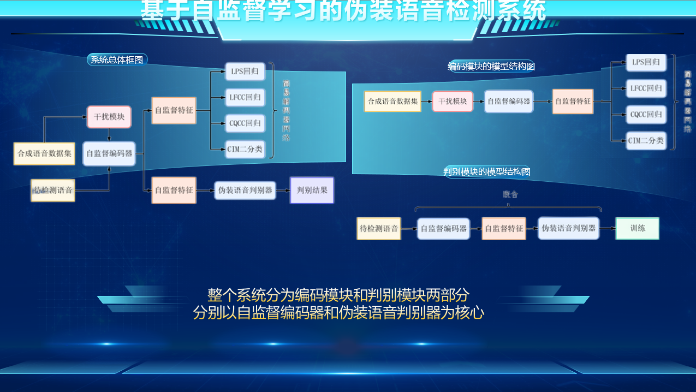
*   **抗欺骗系统集成：** 将自监督检测系统无缝集成到科大讯飞平台。
    *   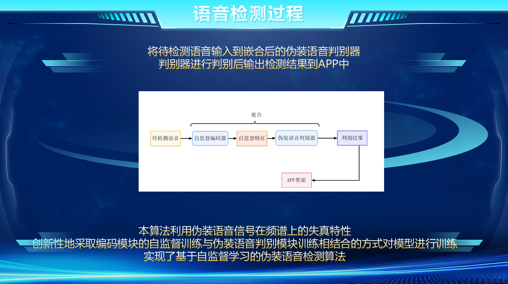

## 应用界面与演示

项目主页 (`index.html`) 通过截图和视频详细展示了应用的界面和功能流程。

### 应用界面截图

展示了包括主界面、注册过程、不同登录场景（非本人声音、伪造语音、成功登录）以及登录界面等。
*(详情请参见项目主页的"应用界面"部分)*

*   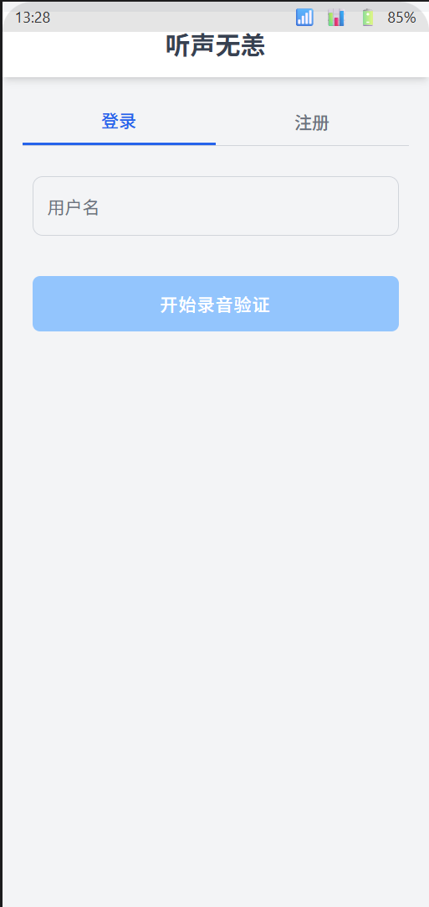
*   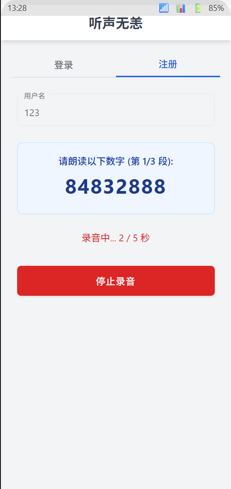
*   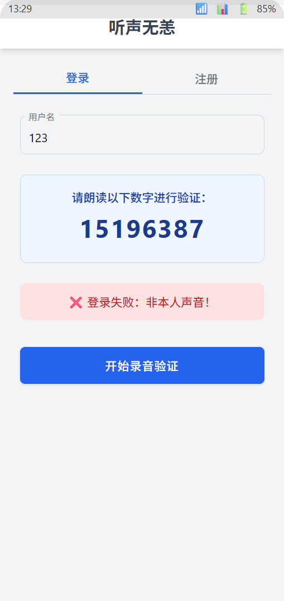
*   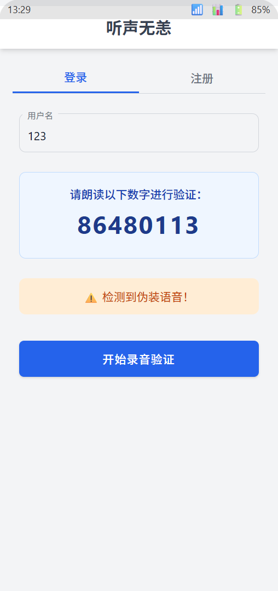
*   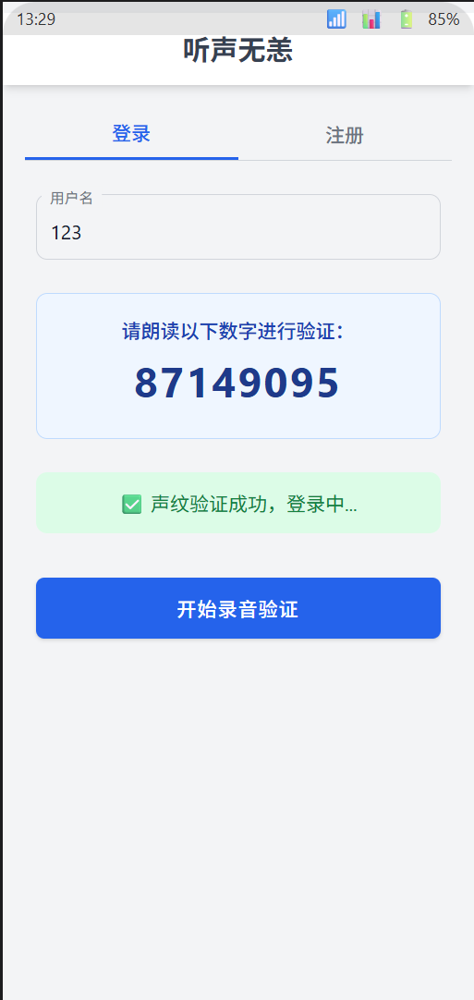
*   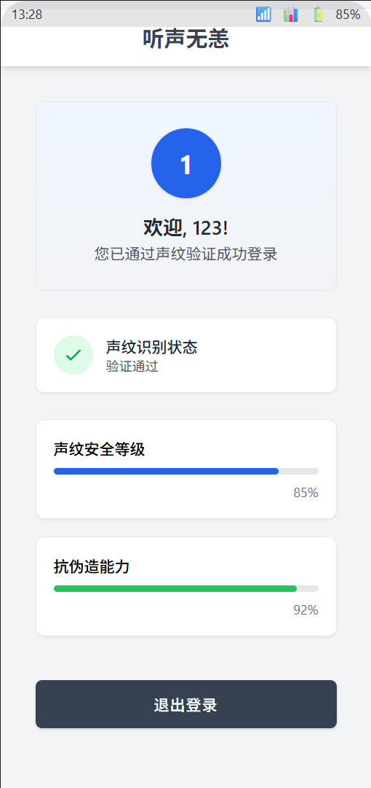

### 功能演示视频

提供了应用主要功能流程的视频演示，包括声纹注册、不同情况下的登录尝试及系统反馈。
*(详情请参见项目主页的"功能演示"部分)*

## 作品测试

系统经过全面测试，验证了其在不同场景下的性能和鲁棒性。
*(详情请参见项目主页的"作品测试"部分)*

*   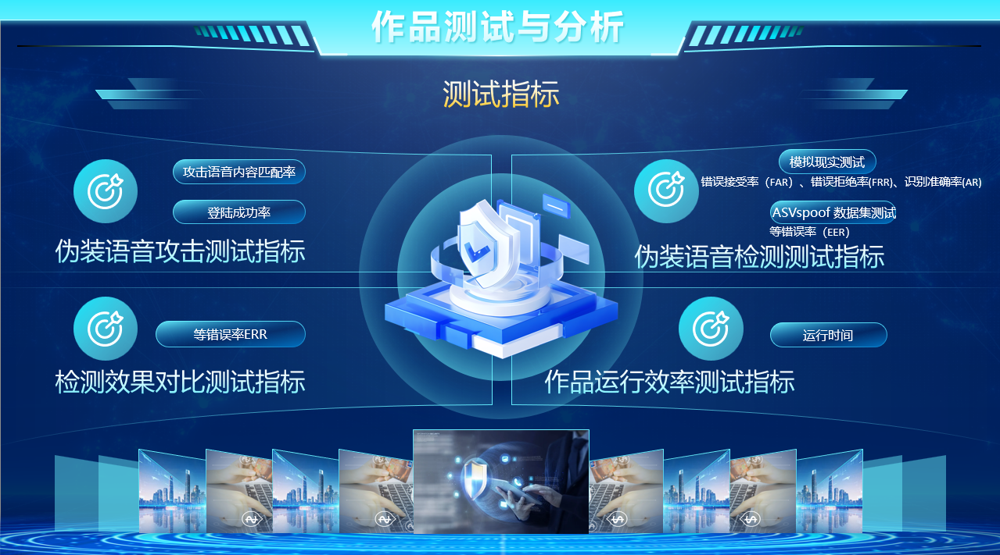
*   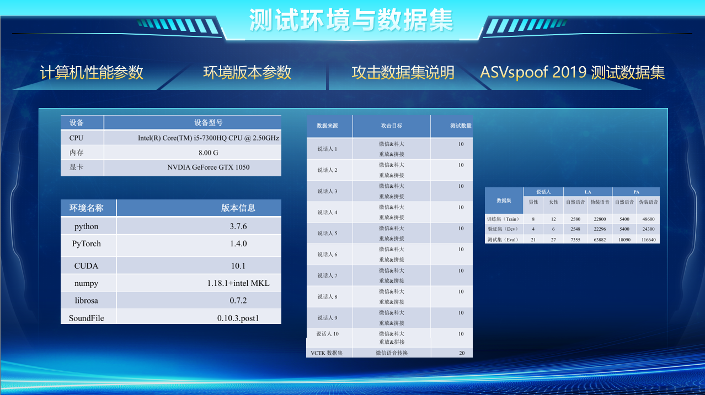
*   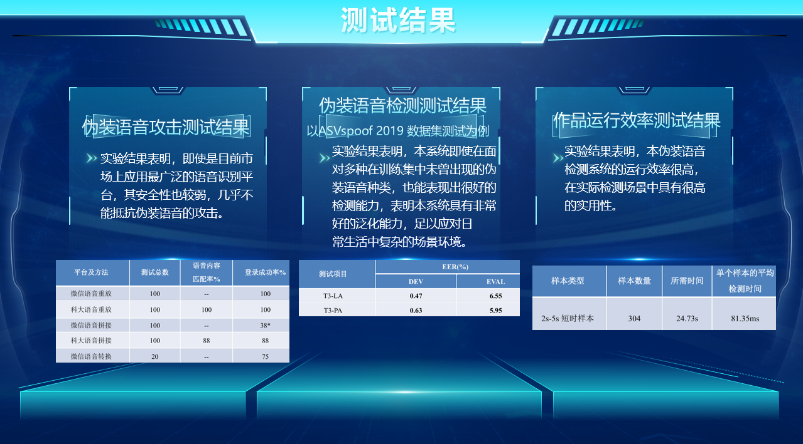
*   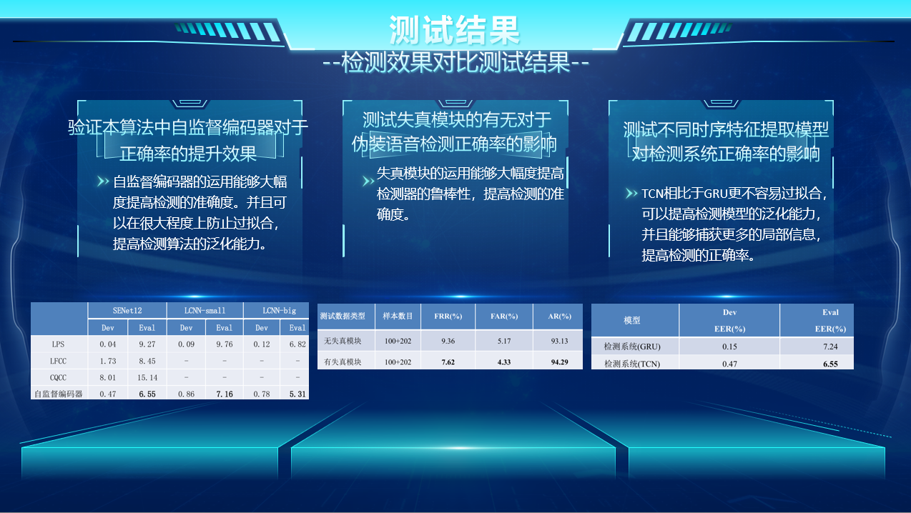

## 如何贡献

欢迎对本项目进行改进和贡献！

*   通过 GitHub Issues 报告问题或提出建议。
*   Fork 本仓库并提交 Pull Requests。

## 联系方式

*   GitHub Issues: [https://github.com/Setsu1na/Speech-Detection/issues](https://github.com/Setsu1na/Speech-Detection/issues)
*   邮箱: setsu.1nal@gmail.com

---

感谢您对"听声无恙"项目的关注！ 